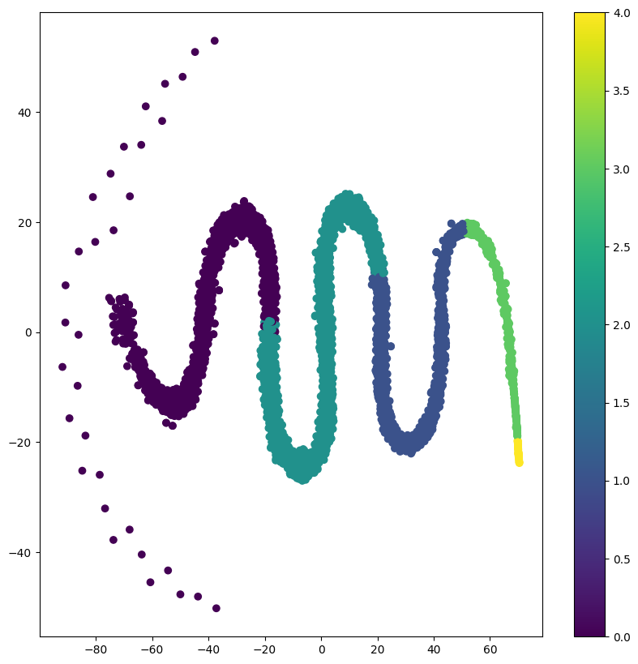

# Project Title: Embeddings as a Fuller Measure of Complexity for Children's Books

## 1. Part 1 : Review of embedding structure 

This project presents a novel, unsupervised learning approach to assessing the complexity of children's literature. The approach uses the theory of embedding scatter to examine two corpora of children's texts: a collection of books from Project Gutenberg available via Kaggle datasets, and a collection of lore from the Brown library. Visualizing the embeddings in reduced dimensions with t-SNE, clear patterns emerge.

## 2. Part 2 : Development of an Alternative Algorithm

We developed an alternative algorithm to assess text complexity, which we tested against the industry-standard Flesch-Kincaid grade level. Our approach yielded an R-squared score of 97%, significantly higher than industry-leading products, which typically achieve around 85%.

## 3. Summary of Models

We used two models in this project. The first is the Word2Vec model, a predictive deep learning based model to generate word embeddings. The second model is the Random Forests model, a machine learning model used to predict the complexity of a sentence based on the features derived from the word embeddings and other sentence characteristics.

## 4. Hyperparameter Optimization

The primary hyperparameters optimized in this project were the number of trees used in the Random Forests model.

## 5. Summary of Results

Part 1: We saw very clear t-SNE visualautiosn emerge particularly when we changed the vectorization method to documents from a fixed number of tokens. Our snake embedding picture is below and can be recreated in the code

Our approach demonstrated a high degree of accuracy in predicting the complexity of children's literature, outperforming existing methods. The use of word embeddings to capture semantic and syntactic information about the words in the texts proved particularly effective, highlighting the potential of this approach for a wide range of applications in text analysis and natural language processing.

## 6. Hardware requirements

Some parts of the project require a GPU to execute and the relevant code has been commented out. All other code was executed on a Apple M2 

## Contact Details
David Roberts   david@blueberryml.com

